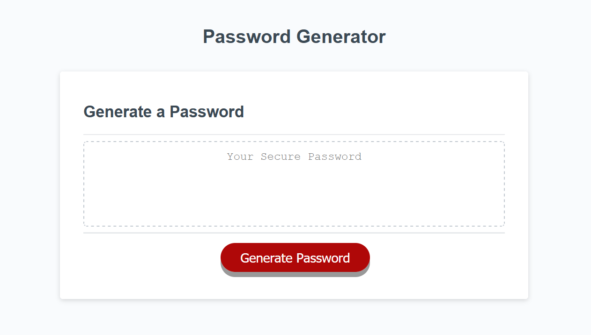
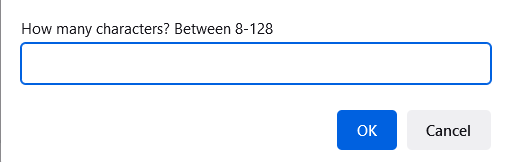

# JS-Password-Generator

JavaScript Password Generator

<!-- Live link to deployed app -->

Repository: https://github.com/Mdudzik92/password-generator-app 
Deployed app: https://mdudzik92.github.io/password-generator-app/

<!-- Technologies used -->

JavaScript, HTML, CSS

<!-- Explanation of what the app is -->

This is a Password Generator application that generates a random password based on user-selected criteria. This app runs in the browser and features dynamically updated HTML and CSS powered by JavaScript. It features a clean and polished user interface and is responsive, adapting to multiple screen sizes.

The user clicks the button to generate a password, they are presented with a series of prompts for password criteria. They are able to choose the length of the password, whether to include lowercase, uppercase, numeric, and/or special characters. After all prompts are answered, a password is generated that matches the selected criteria and written in the box.

<!-- Screenshot -->

<!-- License -->

MIT

<!-- Contact information -->

Email: mdudzik92@gmail.com
